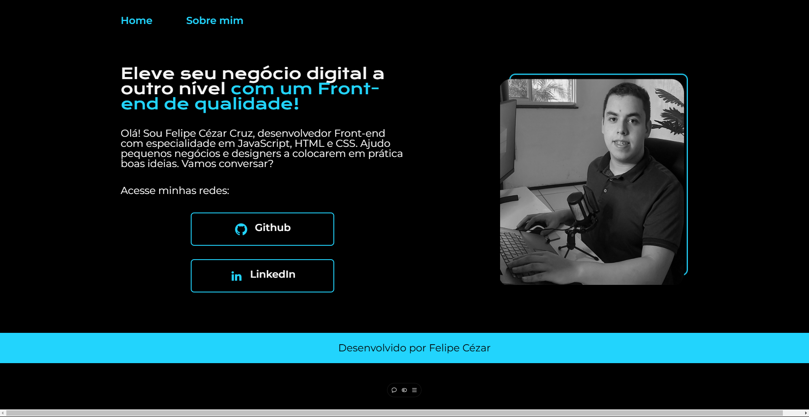

# Meu Primeiro Portfólio

Este repositório contém o meu **primeiro portfólio**, um projeto simples, mas feito com muito amor e dedicação. Foi um passo importante enquanto eu começava a **caminhar no mundo da programação**. Esse portfólio representa o início da minha trajetória, e mesmo sendo básico, tenho um enorme orgulho dele.

---

## Tecnologias Utilizadas

- **HTML5**
- **CSS3**

---

## Objetivo do Projeto

- Criar um portfólio simples para apresentar meus primeiros projetos.
- Praticar a estruturação de páginas e a aplicação de estilos.
- Dar meus primeiros passos no desenvolvimento web de forma prática e significativa.

---

## Pré-visualização

  

---

📚 *Projeto desenvolvido com muito carinho como parte dos meus primeiros passos na programação.*
